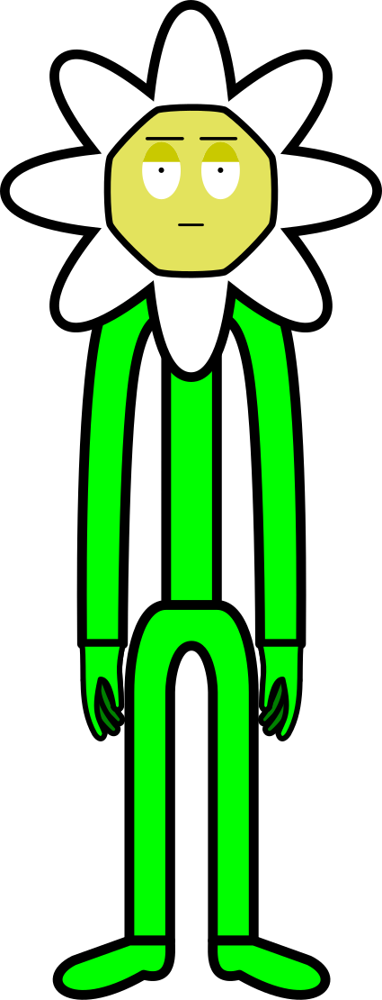
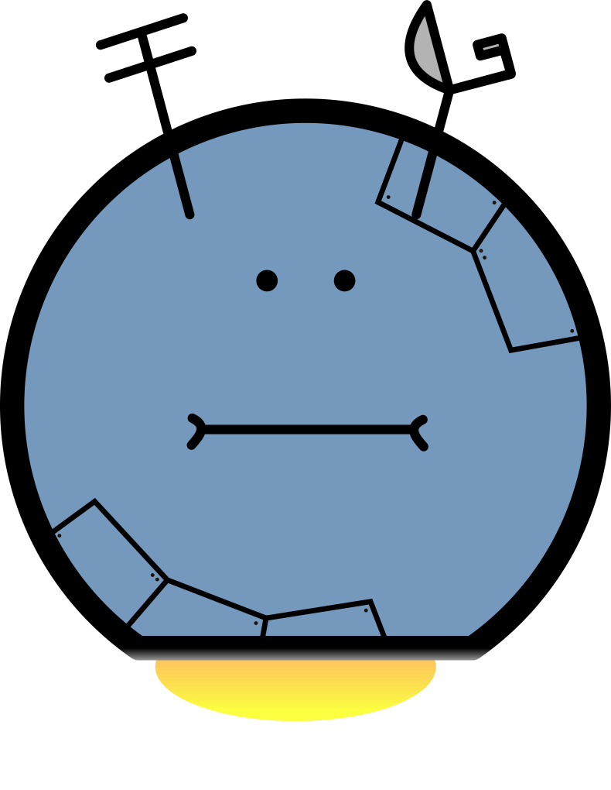

# Ultimate Lands: The Forced Behaviour

---

**Теги**: 2D, песочница, открытый мир, стратегия?, мультиплеер 

## Сеттинг

Космос, галактика с неизвестным названием. Далёкое будущее. Во Вселенной человек уже давно не один: разного рода существа обитают на планетах, астероидах, космических кораблях и их остатках. Большинство существ "знают друг о друге" (общественность в курсе).

Дату и время стало неудобно писать в формате "ДД/ММ/ГГГГ ЧЧ:ММ:СС" из-за отличающихся друг от друга свойств планет Вселенной: разная длительность суток, наличие помимо привычных "день" и "ночь", "ясно" и "облачно", "дождь" и "снег" (и т.п.) других состояний погоды. Вместо стандартного (привычного нам) формата во вселенной игры принято записывать время и дату в земных секундах/минутах/днях (и т.д.) с 01 января 2000 года. Иногда можно встретить варианты записи в системах счисления с основанием 30 или 60 (или других подобных, удобных).

Для некоторых групп существ галактики стали "песочницами", в которых можно творить что угодно: в разных уголках Вселенной можно найти большие скопления скопированных точь-в-точь, одинаковых по цвету, размеру и строению планет. На одной из таких, "случайных", будет развиваться сюжет. _Грубо говоря, каждая такая планета будет являться игровым сервером, в том числе для одиночной игры._

## Персонажи

| Имя                                   | Фото                                              | Описание                                                                              |
| ------------------------------------- | ------------------------------------------------- | ------------------------------------------------------------------------------------- |
| Учёня (Scieny)                        |    | *Главный герой, за которого будет играть пользователь.* Цветочек-человек. Учёный. |
| Роботы-ремоутеры (несколько вариаций) |  | ...                                                                                   |
|                                       |                                                   |                                                                                       |
|                                       |                                                   |                                                                                       |
|                                       |                                                   |                                                                                       |

## Общий сюжет

Делится на три части.

### 1. Предыстория (интро)

TODO

### 2. Развитие событий, игровой процесс

TODO

### 3. Финал

TODO

## Игровые механики

### Планета - очередная мутированная копия

TODO

### Планета = игровой сервер

TODO

### Бесконечные комплексные задания от недоброжелателей

Роботы-"рабовладельцы" будут требовать от игрока бесконечных: 

- исследований артефактов (в т.ч. необычных явлений как "на заметку") на планете: свойств, качеств, что из найденных предметов можно сделать, их пригодность к применению и т.д., 

- развитие программы колонизации планеты роботами, 

- улучшение брони (физических свойств), связи с центром контроля роботов, роботов;

- улучшение начинки их ПО _[можно сделать в виде мини-пазла по обнаружению недочётов в их "коде"; разрешено будет только на высшей стадии доверия]_

Задания будут выдаваться параллельно, по несколько штук за условный раз. У каждого задания будет срок выполнения (дед-лайн) и приоритет (?) выполнения по мнению роботов.

Каждое задание будет иметь условную шкалу понижения шанса освобождения. При этом, разрешённые возможности у главного героя (игрока) могут уменьшиться.

Игрок будет должен выбрать, какое задание от роботов лучше всего сделать первым, а что - последним.

### Прогресс достижения свободы главного героя

Помимо заданий, выдаваемых ИИ, игроку необходимо продумать план спасения главного персонажа путём использования всех доступных возможностей. 

### Контроль главного героя

Игрок не может просто так строить, пользоваться своим инвентарём, подбирать все ресурсы (только процент от всех найденных) или даже говорить в чат (?).

Чем больше, быстрее и качественнее игрок выполняет задания роботов, тем больше **формальных возможностей** даётся игроку. *Например, главному герою будут расширять зону пребывания на планете, давать больший процент от собираемых ресурсов и тому подобное*.

**Неформальные возможности** же могут исчезать как из-за невыполненных принудительных заданий, так и вследствие их успешного достижения. *Например, главный герой может потерять контроль (100% или какую-то часть) над сферой управления добычей ресурсов, если изучит возможность автоматического управления ресурсами для роботов.*

### Возможности песочницы: строить, улучшать, сносить

TODO

### Крафт предметов, артефакты планеты как ресурсы

Рецепт создания каждого предмета игра генерирует самостоятельно из тех предметов, которые есть на планете.

Условно можно назвать артефакты <u>сплавами</u> (?), которые в себе содержать некоторый процент базовых веществ (железо, золото, медь и т.п.), необходимых для создания объектов, предметов, планов для изучения улучшений.

Для большинства объектов в рецепт крафта можно добавить базовые руды в долях содержания (условно - в граммах). Для некоторых объектов можно добавлять в рецепт крафта само 100% наличие уникального артефакта.
